# Monitor de Red - Sistema de Detección de Amenazas

Sistema avanzado de monitoreo y análisis de tráfico de red en tiempo real, diseñado para detectar amenazas de seguridad y proporcionar alertas inmediatas.

**Autora: Julia Gastellu - 2025**

## Características Principales

- Captura y análisis de tráfico de red en tiempo real
- Detección de patrones de tráfico sospechosos y amenazas potenciales
- Dashboard web interactivo con estadísticas y visualizaciones
- Sistema de alertas configurable (email y logs)
- Almacenamiento de datos en base de datos SQLite
- Interfaz en español con documentación completa

## Tecnologías Utilizadas

El sistema ha sido desarrollado utilizando tecnologías modernas y eficientes:

- **Scapy**: Biblioteca potente para manipulación de paquetes de red. Elegida por su flexibilidad para capturar y analizar tráfico de red a bajo nivel, permitiendo una inspección detallada de los paquetes.

- **SQLAlchemy**: ORM (Object-Relational Mapping) que facilita la interacción con la base de datos. Seleccionada por su robustez y capacidad para abstraer la complejidad de las operaciones de base de datos, permitiendo un código más mantenible.

- **Flask**: Framework web ligero y versátil para la creación del dashboard. Escogido por su simplicidad y eficiencia para crear aplicaciones web sin agregar complejidad innecesaria.

- **SQLite**: Sistema de gestión de bases de datos relacional. Elegido por su naturaleza embebida que no requiere un servidor separado, facilitando la instalación y portabilidad del sistema.

## Arquitectura del Sistema

El monitor de red está estructurado en módulos independientes que trabajan en conjunto:

1. **Capturador**: Intercepta paquetes de red utilizando Scapy
2. **Analizador**: Procesa los paquetes para detectar patrones sospechosos
3. **Sistema de Alertas**: Notifica sobre amenazas detectadas
4. **Base de Datos**: Almacena paquetes, alertas y estadísticas
5. **Servidor Web**: Proporciona una interfaz visual para monitoreo

Esta arquitectura modular facilita el mantenimiento y la extensión del sistema, permitiendo agregar nuevas funcionalidades sin afectar los componentes existentes.

## Requisitos

- Python 3.8 o superior
- Privilegios de administrador para captura de paquetes
- En Windows: [Npcap](https://npcap.com/#download) instalado (requerido por Scapy)
- Mínimo 512 MB de RAM disponible
- Espacio en disco para almacenamiento de logs y base de datos

## Instalación y Configuración

### Instalación Automática (Windows)
```bash
instalar.bat
```

### Instalación Manual
```bash
pip install -r requirements.txt
python inicializar_proyecto.py
```

### Requisitos adicionales para Windows
Para que la captura de paquetes funcione correctamente en Windows, es necesario instalar Npcap:
1. Descargar Npcap desde [https://npcap.com/#download](https://npcap.com/#download)
2. Instalar con las opciones predeterminadas

### Configuración Inicial
Editar el archivo `config.json` para personalizar:
- Interfaz de red a monitorear
- Configuración de alertas por email
- Reglas de detección personalizadas
- Puerto del servidor web
- Parámetros de la base de datos

## Uso del Sistema

### Ejecución
```bash
# Windows (ejecutar como administrador)
python main.py

# Linux/macOS
sudo python3 main.py
```

### Acceso al Dashboard
Abrir navegador web en: `http://localhost:8080`

El dashboard proporciona:
- Estadísticas de tráfico en tiempo real
- Gráficos de distribución de protocolos
- Lista de alertas de seguridad recientes
- Métricas de rendimiento del sistema

## Casos de Uso

- **Monitoreo de seguridad**: Detección de escaneos de puertos, intentos de fuerza bruta y tráfico anómalo.
- **Análisis de red**: Visualización de patrones de tráfico y estadísticas de uso.
- **Auditoría**: Registro detallado de comunicaciones para cumplimiento normativo.
- **Educación**: Herramienta didáctica para entender protocolos y seguridad de red.

## Estructura del Proyecto

```mermaid
graph TD
    A[Monitor de Red] --> B[src/]
    A --> C[data/]
    A --> D[docs/]
    A --> E[tests/]
    A --> F[Archivos Principales]
    
    B --> BA[alertas/]
    B --> BB[analizador/]
    B --> BC[base_datos/]
    B --> BD[capturador/]
    B --> BE[configuracion/]
    B --> BF[utils/]
    B --> BG[web/]
    
    BA --> BA1[sistema_alertas.py]
    
    BB --> BB1[analizador_protocolos.py]
    BB --> BB2[detector_amenazas.py]
    BB --> BB3[estadisticas.py]
    
    BC --> BC1[gestor_bd.py]
    BC --> BC2[modelos.py]
    
    BD --> BD1[captura_paquetes.py]
    BD --> BD2[filtros.py]
    
    BE --> BE1[config.py]
    BE --> BE2[reglas_deteccion.json]
    
    BF --> BF1[logger.py]
    BF --> BF2[utilidades.py]
    
    BG --> BG1[servidor.py]
    BG --> BG2[static/]
    BG --> BG3[templates/]
    
    C --> CA[logs/]
    C --> CB[reglas/]
    C --> CC[monitor_red.db]
    
    D --> DA[configuracion.md]
    D --> DB[instalacion.md]
    D --> DC[manual_usuario.md]
    
    E --> EA[test_alertas.py]
    E --> EB[test_analizador.py]
    E --> EC[test_capturador.py]
    
    F --> FA[main.py]
    F --> FB[config.json]
    F --> FC[requirements.txt]
    F --> FD[setup.py]
    F --> FE[inicializar_proyecto.py]
    F --> FF[instalar.bat]
```


